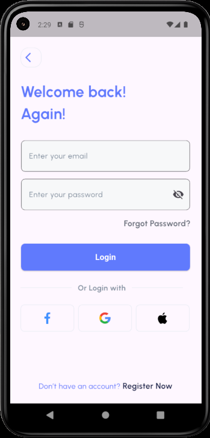
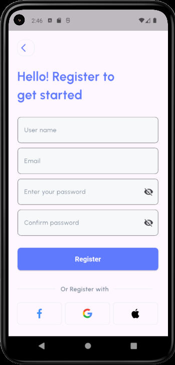
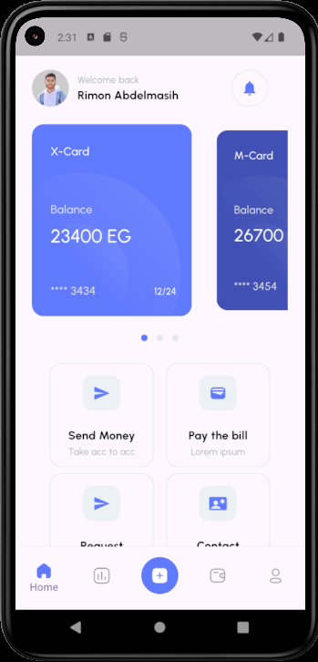
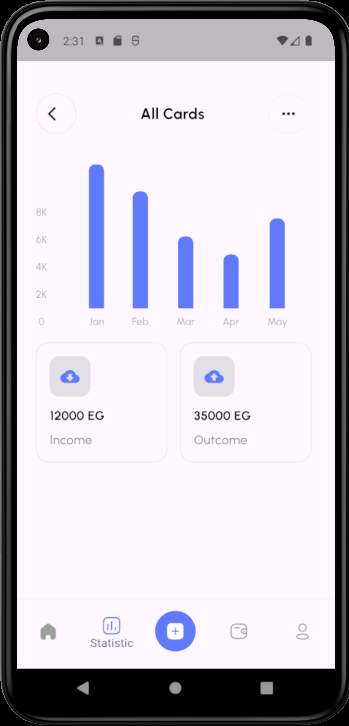
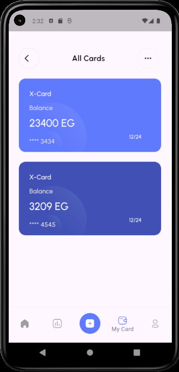
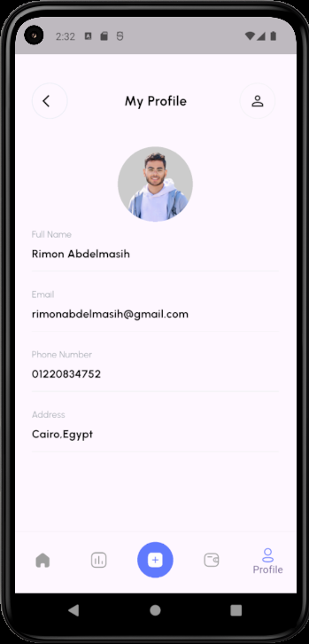
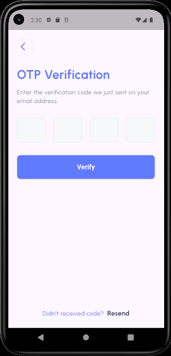
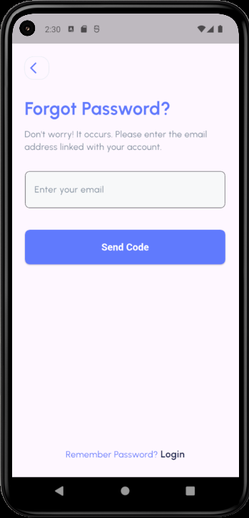

# 💰 Finance App

A modern and responsive **Finance UI Application** built with **Flutter**.  
The app simulates a personal finance management experience with onboarding screens, authentication flow, home dashboard, statistics, cards, and profile screens.

---

## 📱 App Preview

| Onboarding | Login | Register |
|-----------|-------|----------|
|  |  |  |

| Home | Statistics | Cards |
|------|------------|-------|
|  |  |  |

| Profile | OTP | Forget Password |
|---------|-----|-----------------|
|  |  |  |

---

## ✨ Overview

**Finance App** is a Flutter UI project designed to practice building clean, scalable, and responsive mobile interfaces.

The project focuses on:

- Building a modern finance mobile UI
- Creating a complete authentication flow
- Applying feature-based project structure
- Using reusable widgets
- Managing UI state using Provider
- Building responsive screens using Flutter ScreenUtil
- Implementing clean navigation using GoRouter
- Working with SVG assets, custom fonts, and organized styling

---

## 🚀 Features

### 🧭 Onboarding

- Interactive onboarding screens
- Carousel slider implementation
- Dots indicator for page tracking
- Clean introduction to the app flow

### 🔐 Authentication Flow

- Login screen
- Register screen
- Forget password screen
- OTP verification screen
- Create new password screen
- Password changed confirmation screen
- Form validation UI

### 🏠 Main App Screens

- Home dashboard
- Statistics screen
- Cards screen
- Profile screen
- Add screen
- Bottom navigation layout

### 🎨 UI & Design

- Responsive UI using `flutter_screenutil`
- SVG icons support using `flutter_svg`
- Custom Urbanist font
- Reusable app components
- Organized styling system
- Clean and modern finance-themed interface

---

## 🛠️ Tech Stack

- **Flutter**
- **Dart**
- **Provider**
- **GoRouter**
- **Flutter ScreenUtil**
- **Flutter SVG**
- **Carousel Slider**
- **Dots Indicator**
- **Pin Code**

---

## 📦 Packages Used

```yaml
dependencies:
  flutter:
    sdk: flutter
  cupertino_icons: ^1.0.8
  flutter_screenutil: ^5.9.3
  go_router: ^17.1.0
  flutter_svg: ^2.2.3
  provider: ^6.1.5+1
  pin_code: ^1.2.0
  carousel_slider: ^5.1.2
  dots_indicator: ^4.0.1
```

---

## 📁 Project Structure

```txt
lib/
├── main.dart
│
├── core/
│   ├── routing/
│   │   └── app routing files
│   │
│   ├── styling/
│   │   └── app colors, text styles, assets, and theme files
│   │
│   └── widgets/
│       └── reusable shared widgets
│
└── features/
    ├── auth/
    │   ├── auth_provider/
    │   │   └── authentication provider logic
    │   │
    │   ├── widgets/
    │   │   └── reusable auth widgets
    │   │
    │   ├── login_screen.dart
    │   ├── register_screen.dart
    │   ├── forget_password_screen.dart
    │   ├── otp_verification_Screen.dart
    │   ├── create_password_screen.dart
    │   └── password_changed_screen.dart
    │
    ├── home_page/
    │   └── home screen files and widgets
    │
    ├── statestics/
    │   └── statistics screen files and chart UI
    │
    ├── card_page/
    │   └── cards screen files
    │
    ├── profile_page/
    │   └── profile screen files
    │
    ├── main_screen/
    │   └── main layout and bottom navigation screen
    │
    ├── onbording_Screen/
    │   └── onboarding screen files
    │
    └── add_screen.dart
```

---

## 🏗️ Architecture

The project follows a **Feature-Based Architecture**.

### Core Layer

The `core` folder contains shared code used across the whole application:

- Routing configuration
- App styling
- Reusable widgets
- Shared assets and constants

### Features Layer

The `features` folder contains the main app modules.  
Each feature keeps its own screens, widgets, and logic separated from the rest of the project.

### State Management

The app uses **Provider** for managing UI-related state, especially inside the authentication flow.

---

## 📲 Screens

### Onboarding

Introduces the app using a smooth slider and page indicators.

### Authentication

Includes a complete UI flow for:

- Login
- Register
- Forget password
- OTP verification
- Create new password
- Password changed confirmation

### Home

Displays the main finance dashboard with balance, transactions, and quick actions.

### Statistics

Shows financial statistics using a custom chart UI.

### Cards

Displays bank card UI and card-related information.

### Profile

Displays user profile information and settings UI.

---

## ⚙️ Getting Started

### 1. Clone the repository

```bash
git clone https://github.com/rimonnnn/financeApp.git
```

### 2. Navigate to the project folder

```bash
cd financeApp
```

### 3. Install dependencies

```bash
flutter pub get
```

### 4. Run the app

```bash
flutter run
```

---

## 📌 Requirements

- Flutter SDK
- Dart SDK
- Android Studio or VS Code
- Android Emulator or physical device

---

## 🔮 Future Improvements

- Connect the app with a real backend
- Add Firebase Authentication
- Add real transaction data
- Add API integration
- Add local storage
- Improve state management structure
- Add dark mode
- Add animations and micro-interactions
- Add unit and widget tests

---

## 👨‍💻 Author

**Rimon Abdelmasih**

- GitHub: [rimonnnn](https://github.com/rimonnnn)
- LinkedIn: [Rimon Abdelmasih](https://www.linkedin.com/in/rimon-abdelmasih)

---

## 📄 License

This project is built for learning and portfolio purposes.